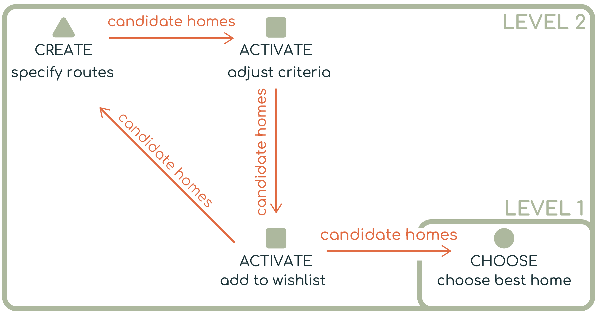
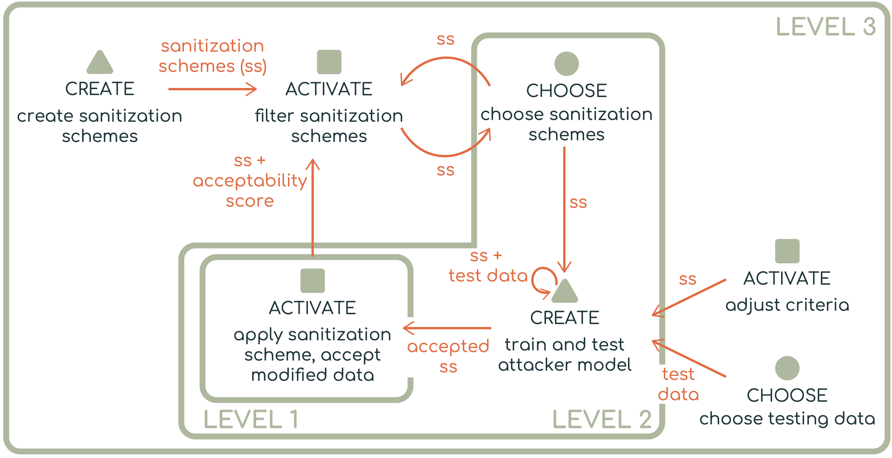
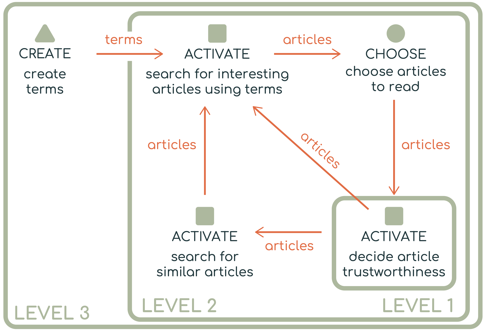
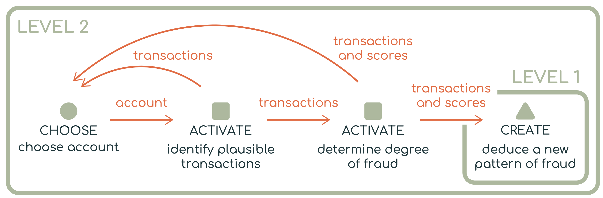

# Case Studies

## Learning from Decision-Support Systems

Case studies show how the typology can describe real visualization systems. They also demonstrate that the same three tasks can model decision-making across different domains.

The original typology paper presents four case studies: **Homefinder Revisited**, **Umbra**, **Centaurus**, and **WireVis**. Each case study uses the typology to describe the decision-making process supported by a visualization system.

<hr>

## Case Study: Homefinder Revisited

[Homefinder Revisited](https://dl.acm.org/doi/10.1145/3173574.3173821) introduces ReACH, a visual analytics system that helps users find ideal homes. Users provide information such as daily routes, activities, and preferences. The system then generates possible homes based on reachability, proximity to amenities, and user-specified criteria.



### Decision Goal

At the highest level, ReACH supports users in choosing an ideal home from a set of candidates.

### Decision Breakdown

The top-level CHOOSE task can be decomposed into several supporting decision tasks.

First, the system helps users CREATE candidate homes based on their routes, activities, and preferences. Then, users ACTIVATE homes that satisfy their search criteria, such as reachability, location, or other preferences. Users may then ACTIVATE a smaller set of homes by adding them to a wishlist. Finally, they CHOOSE the best home from that refined set.

<!-- ### Why This Case Matters

This case represents a familiar multi-criteria decision-making pattern (CREATE → ACTIVATE → CHOOSE).

ReACH also adds an intermediate wishlist step, showing how users may iteratively refine and manage candidate options before making a final choice. -->

<hr>

## Case Study: Umbra

[Umbra](https://ieeexplore.ieee.org/document/9258413) is a visual analytics tool for sanitizing sensitive datasets. It helps analysts reduce privacy risks while preserving the usefulness of the data. The system can identify potential risks, suggest sanitization actions, and simulate attacks.



### Decision Goal

At the highest level, Umbra supports an ACTIVATE decision: deciding whether a sanitized dataset is acceptable.

```text
Level 1:
ACTIVATE sanitized dataset
```

This means the analyst evaluates whether the modified dataset satisfies privacy and utility requirements.

### Decision Breakdown

The top-level ACTIVATE task can be decomposed into a loop involving sanitization schemes and simulated attacks.

This case shows how create, activate, and choose can form iterative loops. Users may repeatedly generate schemes, test them, and decide whether the result is acceptable.

```text
Level 2:
→ CHOOSE sanitization scheme
→ CREATE simulated attack
→ ACTIVATE sanitized dataset as acceptable or unacceptable
```

The analyst first CHOOSES a sanitization scheme and where to apply it. Then the system helps CREATE a simulated attack to test whether sensitive information can still be inferred. Based on the results, the analyst ACTIVATES the sanitized dataset if it meets acceptability criteria.

This process can be decomposed further.

```text
Level 3:

In support of CHOOSE (choose sanitization schemes)
→ CREATE sanitization schemes
→ ACTIVATE acceptable sanitization schemes

In support of CREATE (train and test attacker model)
→ ACTIVATE using criteria
→ CHOOSE testing data
```

<!-- ### Why This Case Matters

Umbra differs from Homefinder because the number of possible options is not fixed. The system can generate many possible sanitization schemes, so the central decision is not simply choosing from a finite list. Instead, the analyst iteratively creates, evaluates, and refines schemes until one is acceptable. -->

<hr>

## Case Study: Centaurus
[Centaurus](https://vtechworks.lib.vt.edu/items/9f52febe-b99a-4857-80c8-9e8bef51c2b8) supports users in evaluating the truthfulness of claims by analyzing related news articles. Users are given a claim, such as a tweet, along with a mixture of trustworthy and untrustworthy articles. They use the system to explore articles, extract relevant information, and assess article trustworthiness.



### Decision Goal

At the highest level, Centaurus supports an ACTIVATE decision: deciding whether articles are trustworthy.

```text
Level 1:
ACTIVATE trustworthy articles
```

### Decision Breakdown
The main ACTIVATE decision is supported by several lower-level decisions.

```text
Level 2:
→ ACTIVATE interesting articles using search terms
→ CHOOSE articles to read
→ ACTIVATE similar articles
```

Users first ACTIVATE articles that appear relevant based on search terms. They then CHOOSE which articles to inspect more deeply. After reading and analyzing an article, they ACTIVATE whether the article should be considered trustworthy. The system can also support another ACTIVATE task by helping users search for similar articles.

The search process can be decomposed further.

```text
Level 3:
→ CREATE search terms
```

Users may manually CREATE keywords or terms, which are then used to ACTIVATE relevant articles.

<!-- ### Why This Case Matters

Centaurus shows how the typology can reveal similarities between tools from very different domains. Although Centaurus focuses on article trustworthiness and Umbra focuses on data sanitization, both involve a similar pattern of creating inputs, activating relevant candidates, choosing items for deeper inspection, and evaluating acceptability. -->

<hr>

## Case Study: WireVis
[WireVis](https://ieeexplore.ieee.org/abstract/document/4389009?casa_token=5GE_AuGKblUAAAAA:KhB09LMU920GqaDndYWLWeG_balHMD2UOCPDg3enqG_CfWvZOtCjd9g7ipk2svdhNuva7wM) is a visual analytics system for exploring large collections of financial wire transactions. It helps analysts detect suspicious activity, such as fraud or money laundering, by examining transaction attributes including keywords, amounts, dates, and account relationships.



### Decision Goal

In this case study, the focus is on discovering previously unknown strategies used to commit financial fraud. This is a CREATE decision because the analyst is synthesizing evidence into a new insight or pattern.

```text
Level 1:
CREATE new fraud pattern
```

### Decision Breakdown

The top-level CREATE decision depends on several supporting decisions.

```text
Level 2:
→ CHOOSE account to investigate
→ ACTIVATE plausible transactions
→ ACTIVATE degree of fraud
```

First, the analyst CHOOSES a promising account to investigate. Then, they ACTIVATE transactions that appear plausible or relevant to suspicious behavior. Next, they ACTIVATE whether those transactions indicate some degree of fraud. Finally, the analyst may CREATE a new fraud pattern by synthesizing the evidence gathered through the system.

<!-- ### Why This Case Matters

WireVis shows that the root decision in a decision-support tool does not always have to be CHOOSE or ACTIVATE. Sometimes the main goal is to CREATE a new insight, explanation, or pattern. In this case, the analyst is not only selecting suspicious transactions; they are constructing a new understanding of how fraud may be occurring. -->