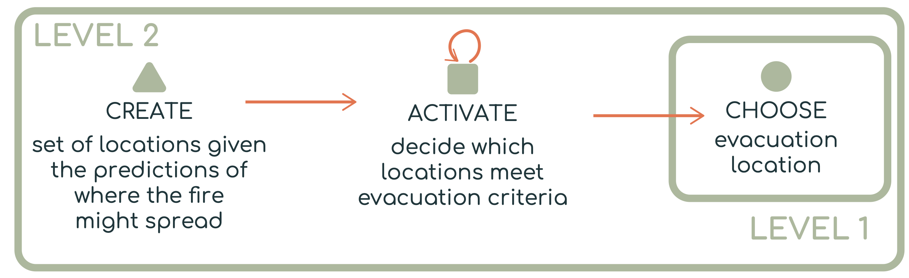

# Composing Decision Tasks

Real-world decisions are rarely isolated. A user may need to generate options, filter them, compare them, revise criteria, and repeat the process.

The typology supports this complexity through **composability** and **hierarchy**.

<hr>

## Why Composability Matters for Design

Composability helps designers answer practical design questions:

* What does the user need to decide first?
* Which decisions depend on earlier outputs?
* Where does the user need to iterate?
* Which information should be passed between views?
* Which decisions are unsupported in the current interface?
* Which tasks should be automated, interactive, or collaborative?

A decision diagram can therefore become a blueprint for visualization design.

<hr>

## Diagramming Decision Problems

Decision problems can be represented as node-link diagrams. Here is a wildfire evacuation example:



* circles represent choose tasks;
* squares represent activate tasks;
* triangles represent create tasks;
* arrows represent information flow;
* loops represent iteration;
* levels represent hierarchy.

The typology paper introduces this diagramming approach to show how decision tasks relate to one another in a larger decision-making process.

<hr>

## Composability

Decision tasks are **composable** when the output of one task becomes the input to another. In other words, decisions can be connected into a workflow where each task transforms information for the next task.

In the wildfire evacuation example shown in the above figure, responders may need to decide where residents should evacuate. This overall decision can be represented as a sequence of smaller decision tasks:

```text
→ Create possible evacuation locations
→ Activate locations that meet evacuation criteria
→ Choose the final evacuation location
```

The first task, CREATE, uses information such as predicted fire spread, road access, shelter availability, and population distribution to generate a set of possible evacuation locations.

The second task, ACTIVATE, evaluates each candidate location independently against safety and feasibility criteria. For example, a location may be activated if it is far enough from the projected fire zone, reachable by available roads, and large enough to support evacuees.

The third task, CHOOSE, compares the remaining acceptable locations and selects the best one, such as the safest, closest, or most logistically feasible evacuation site.


This composition shows how information moves through the decision process. Fire forecasts and geographic information are transformed into candidate locations, candidate locations are transformed into acceptable locations, and acceptable locations are transformed into a final decision.

Composability is useful because it makes the decision process visible. Rather than treating “choose an evacuation location” as a single black-box decision, the typology helps designers see which intermediate decisions need support from data, visualization, computation, or human judgment.

<hr>

## Hierarchy

Decision tasks can also be organized hierarchically. A high-level decision may depend on several lower-level decisions that support it.

In the wildfire example, the top-level decision is:

```
Level 1: Choose the best evacuation location
```

However, this decision cannot be made directly without first resolving supporting decisions. At a lower level, responders may need to create possible locations, filter them according to constraints, and then compare the remaining options.

```
Level 1:
- CHOOSE the best evacuation location

Level 2:
- CREATE possible evacuation locations from fire-spread predictions and geographic constraints
- ACTIVATE locations that satisfy safety, capacity, and accessibility criteria
```

A hierarchical view might look like this:

```
Level 1:
CHOOSE evacuation location
│
└── Level 2:
    CREATE candidate locations
        ↓
    ACTIVATE locations that meet evacuation criteria
```

The hierarchy shows that the Level 1 decision depends on the Level 2 decisions. The user is not only choosing a location; they are also relying on prior decisions about what locations are possible and which locations are acceptable.

This is important for visualization design because different levels of the hierarchy may require different kinds of support. For example, a visualization may need to help users inspect predicted fire spread during the CREATE task, compare shelter capacity and road access during the ACTIVATE task, and weigh tradeoffs between remaining evacuation sites during the CHOOSE task.

<hr>

## Summary

Composability and hierarchy help describe both the flow and the structure of the decision-making process:

Composability shows how decision tasks connect.
Hierarchy shows how smaller decisions support larger decisions.

In the wildfire case, this means the typology can describe not only the final evacuation decision, but also the chain of supporting decisions that make that final decision possible.