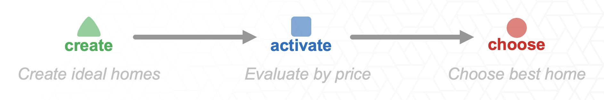
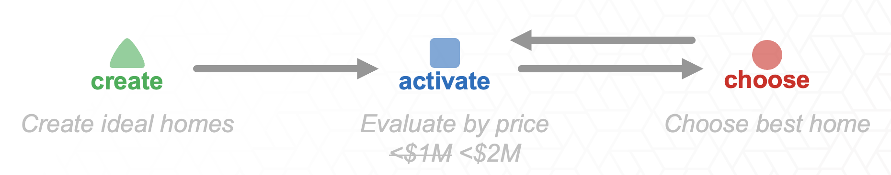
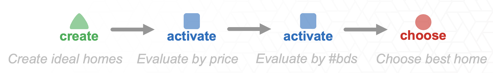
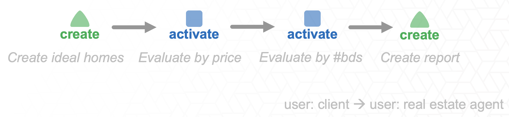
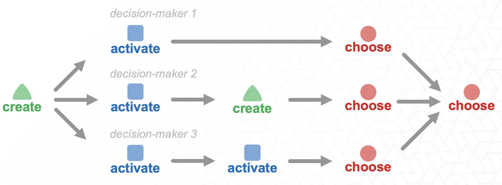

# Problem Formulation
## Step 3: Add Information Flow and Iteration
Once participants have identified the major decisions, they add arrows showing how information moves between them.

Ask:
> What information is passed from one decision to the next?

Use arrows to show flow. 
* Add loops when users need to revisit criteria, regenerate options, or refine selections. 
* When you think that users might run out of options after doing an activate, then connect the activate decision to a create decision.
* When users might want to adjust the threshold of an activate decision add a self loop for the activate decision.

This step helps participants see that decision-support tools are not only about showing data. They also need to support transitions between decision stages.

## Home-buying Example
The decisions mapped in Step 2 can be turned into a workflow. The workflow is not just a linear sequence; it also includes loops when the option set is too small or when the buyer’s criteria need to be revised.

Below are some example workflows:

### Simple workflow

- In the home buying example we could have create homes, where we generate 3 options A, B and C.
- Then activate, where we compare each home against the price threshold, in this case home B is filtered out.
- Then choose the best home, where maybe even though both homes are affordable, C is cheaper than B but also closer to work.

### Iteration

- We can also represent how someone would iterate on a decision.
- For example, when activating by price, we might start by filtering out homes priced over $1 million.
- If that leaves us with no available options to choose from, we’d go back and adjust the threshold — say, increasing it to $2 million, until some homes meet the criteria.
- On the diagram, this looping back is shown with a backward arrow, representing how users revisit and modify decisions

### Repeated Decision Types

- This framework isn’t just about the CREATE → ACTIVATE → CHOOSE pattern.
- In practice, these tasks can appear in any order or combination
- For example, we can use repeated tasks to represent different thresholds we are using in the activate decision.
- One for price and another one for the number of bedrooms.

### Different Decision Goals

- We can also change the goal of the decision process
- In this case the goal is to CREATE.
- For instance, when a real estate agent prepares a report of homes for their client, they’re generating new information rather than selecting a single option.

### Collaborative Decision-Making

- Other configurations can also represent decision-making processes that are collaborative, involving multiple people.
- For example, when a family is searching for a home together
- Each member goes through their decision process and shortlists their favorite options, and then they come together to compare and decide on one home to buy.