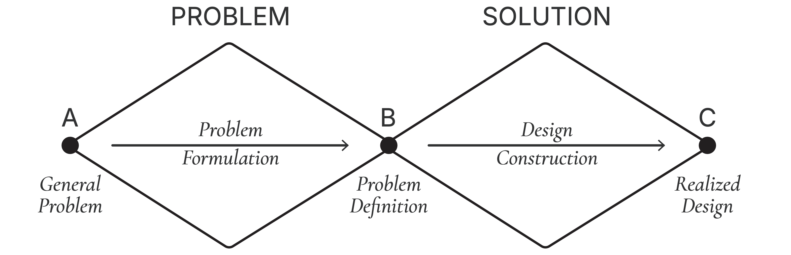

## Tutorial Framing

This scenario can help participants practice using the typology during the [Double-Diamond Design Methodology](https://www.thefountaininstitute.com/blog/what-is-the-double-diamond-design-process) stages: the problem definition, the design construction, and the transition between the two stages.

During the **problem definition stage**, participants should focus on understanding the top-level embryo selection decision, the current patient’s cohort, the historical dataset, relevant attributes, smaller supporting decisions, information flow, thresholds, expert judgment points, and uncertainty.

During the **design construction stage**, participants should use their decision diagram to sketch interface components such as a current-patient cohort view, historical reference summaries, patient and hormone context summaries, filters and threshold controls, embryo image galleries, side-by-side comparison views, similar-case panels, candidate shortlist panels, uncertainty flags, case detail views, and selection rationale builders.