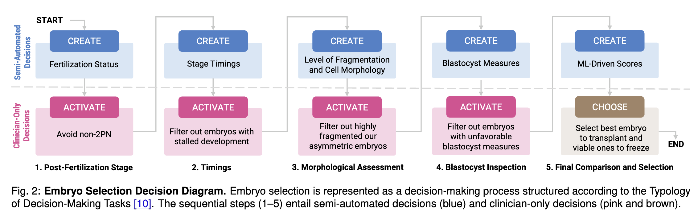
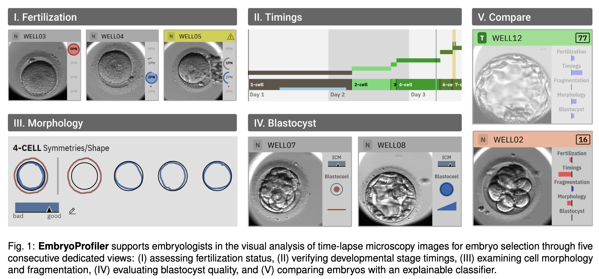

# Designing for Healthcare
In a collaboration with the [Visual Computing Group at Harvard University](https://vcg.seas.harvard.edu/) and the [Tel Aviv Sourasky Medical Center](https://www.tasmc.org.il/en/), we've designed a visualization decision-support system that showcases the impact of grounding the design process in the Typology of Decision-Making Tasks.

[Link to Paper](https://ieeexplore.ieee.org/document/11278822){: .btn .btn-purple }

## Real-World Example: EmbryoProfiler

**EmbryoProfiler** is a visual clinical decision-support system for IVF. It helps embryologists analyze time-lapse microscopy images and select embryos for transfer or cryopreservation.

The system supports a structured workflow:

1. assess fertilization status;
2. verify developmental stage timings;
3. inspect cell morphology and fragmentation;
4. evaluate blastocyst quality;
5. compare embryos using an explainable classifier.

The paper describes **EmbryoProfiler** as a semi-automatic, visualization-based workflow that guides clinicians through embryo grading and final comparison.

## Decision Diagram

EmbryoProfiler’s decision process can be represented as:

This structure appears directly in the EmbryoProfiler paper’s decision diagram, which organizes the IVF workflow using create, activate, and choose tasks.

## How the Design Follows the Typology
### Create Tasks

EmbryoProfiler uses machine learning to create clinically interpretable information from microscopy images, including:

* pronuclei counts;
* developmental stage timings;
* cell morphology;
* fragmentation levels;
* blastocyst measures;
* viability scores.

These generated features are not final decisions on their own. They support later clinician decisions.

### Activate Tasks

Clinicians use criteria to exclude or keep embryos:

* avoid non-2PN embryos;
* filter out stalled development;
* filter out highly fragmented or asymmetric embryos;
* filter out embryos with unfavorable blastocyst measures.

These are activate tasks because embryos are evaluated against clinical thresholds or criteria.

### Choose Task

At the end of the workflow, clinicians compare embryos and select the best embryo for transfer.

This is a choose task because the decision is comparative and involves selecting the best candidate from the available viable embryos.

Visualization Design Patterns

EmbryoProfiler demonstrates several design patterns that align with the typology:

* workflow tabs for sequential decision stages;
* small multiples for embryo overview;
* human-in-the-loop highlighting for uncertain predictions;
* timeline views for frame-by-frame inspection;
* visual feature summaries for grading;
* interactive correction of automated features;
* comparison view for final selection.

The system includes dedicated views for fertilization, timings, morphology, blastocyst inspection, and comparison, each aligned with a step in the decision workflow.

For more details, please see the [full paper](https://ieeexplore.ieee.org/document/11278822).